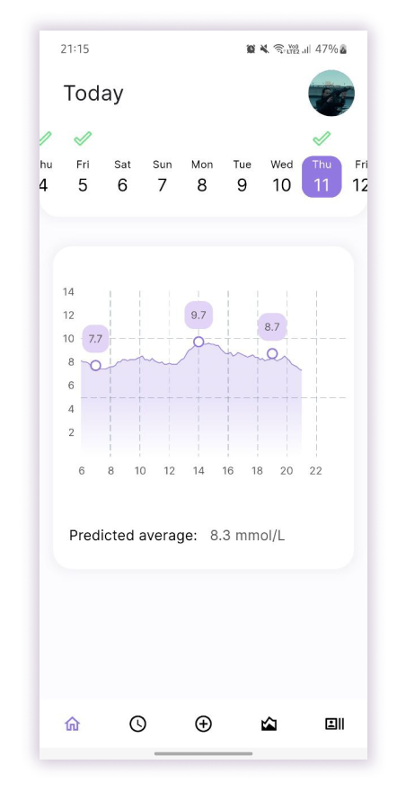

# Mobile app for people with Type 1 Diabetes

Our project aimed at improving functionalities of mobile apps dedicated to people with diabetes to help users with their diabetes management and decrease attrition rate. Ultimately, we developed a cross-platform mobile app with three completely novel features: drag & drop data logging, incorporated an ML model for visualization of diabetes data and a rule-based chatbot for monitoring the diabetes progress. 

